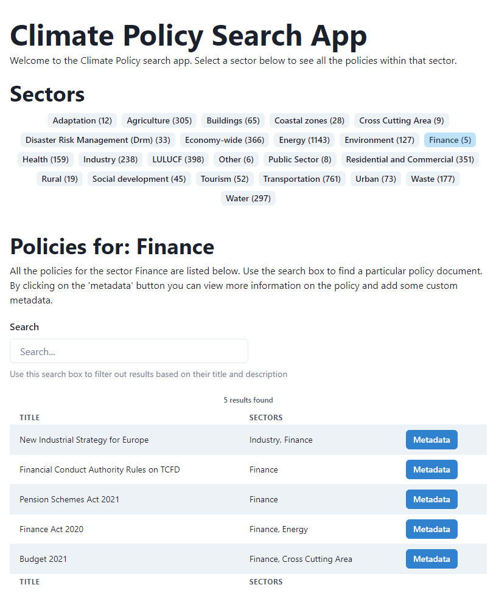

# Climate Policy Search

The task was to take a CSV datase containing textual summaries of climate laws and policies and create an application that could be used to search for particular policies as well as add metadata to them. (Note: the metadata is only stored locally in `localstorage`).

## Key Features

- Simple and intuitive responsive interface using Chakra-UI
- Filtering and search ability
- Selections and searches are persisted between refreshes via URL state
- Ability to store metadata for any given policy and persistance between sessions

## Techstack

- React - allows for elegant atomic component composition
- Vite - very fast build and hot reload speeds
- Typescript - ensures a much more reliable and robust development experience
- react-router - in order to achieve decent persistance between refreshes and between components
- Chakra UI - not used before so a good opportunity to learn, nice components out of the box, particularly the drawer and table components
- Lodash - helpful object and array utilities

## Running the application

Using `yarn`:

Install the dependancies, navigate to the folder and run

```
yarn
```

Preview the build version of the application and view at: http://localhost:4173/

```
yarn build
yarn preview
```

Run the application in development and watch mode: http://localhost:3000/

```
yarn dev
```

---

### Preview

<figure>

<figcaption>Preview of the application viewed in the browser</figcaption>
</figure>

## Improvements

Given investing more time into the tech test I could:

- Improve performance for long lists via a pagination or infinite scrolling package
- Hook up the functionality to a working back-end
- Move some of the data handling into a node back-end serving the front-end
- Write unit tests
